# Docker
## Instalar Docker Community Edition
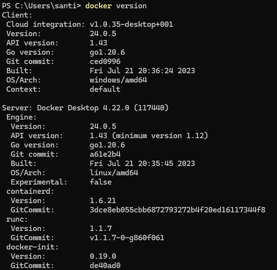

## Obtener la imagen BusyBox

## Ejecutando contenedores
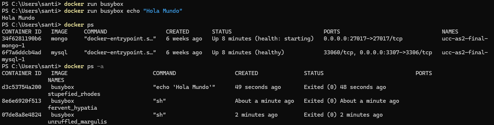

## Ejecutando en modo interactivo
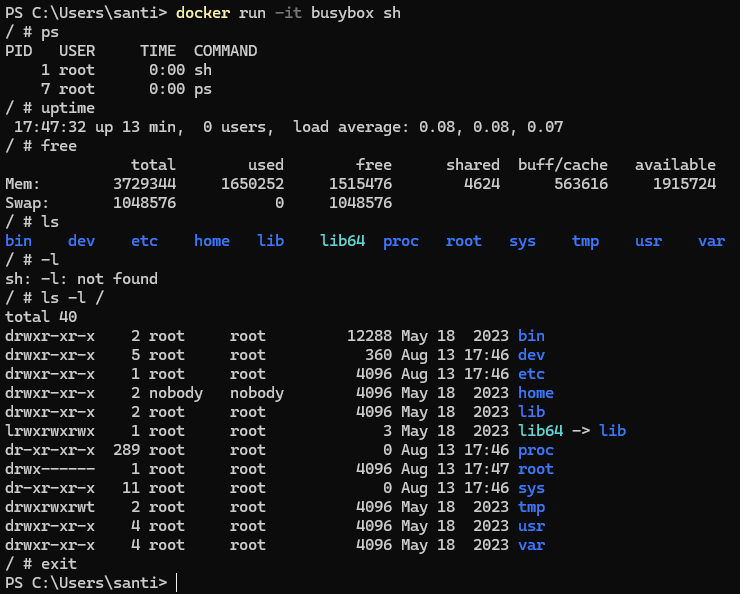

## Borrando contenedores terminados
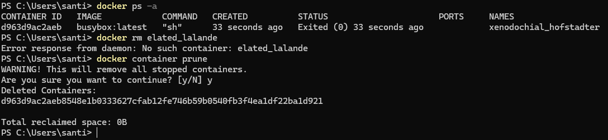

## Construir una imagen
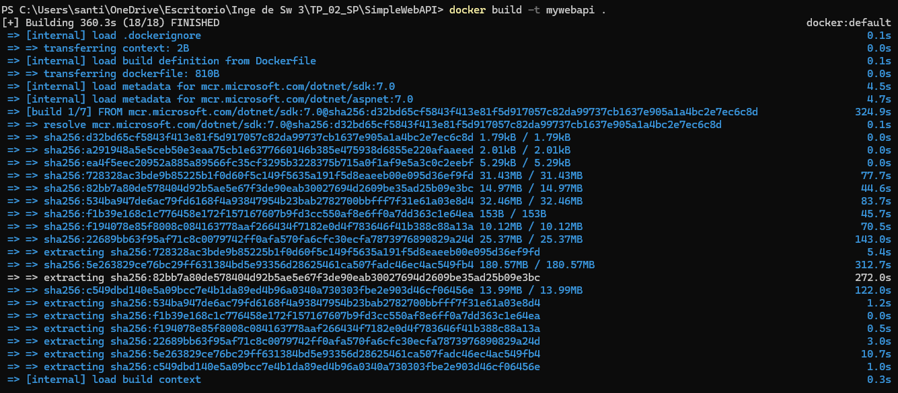
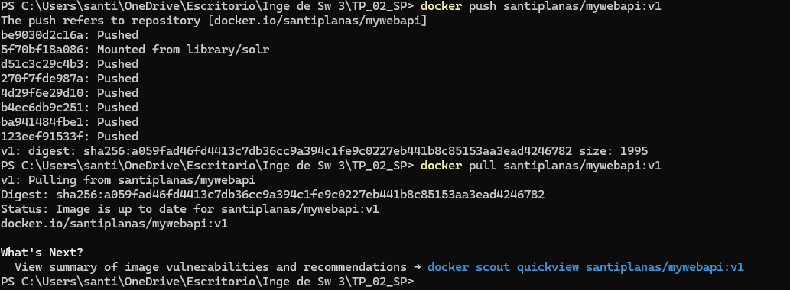

## Publicando puertos
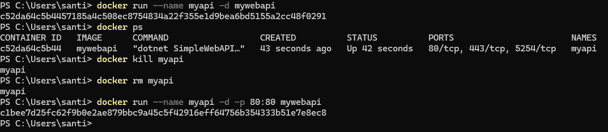

## Modificar Dockerfile para soportar bash
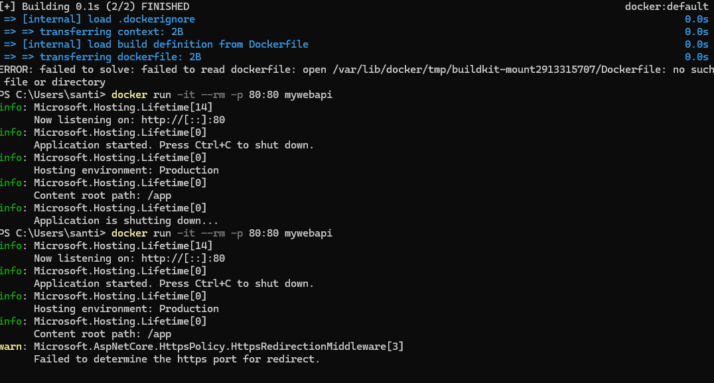

## Montando volúmenes

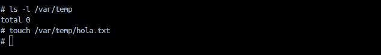

## Utilizando una base de datos
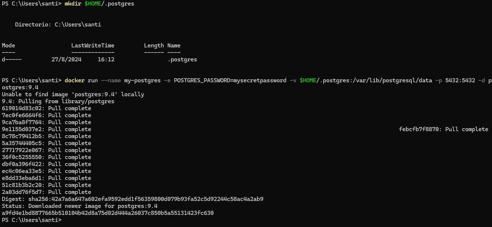
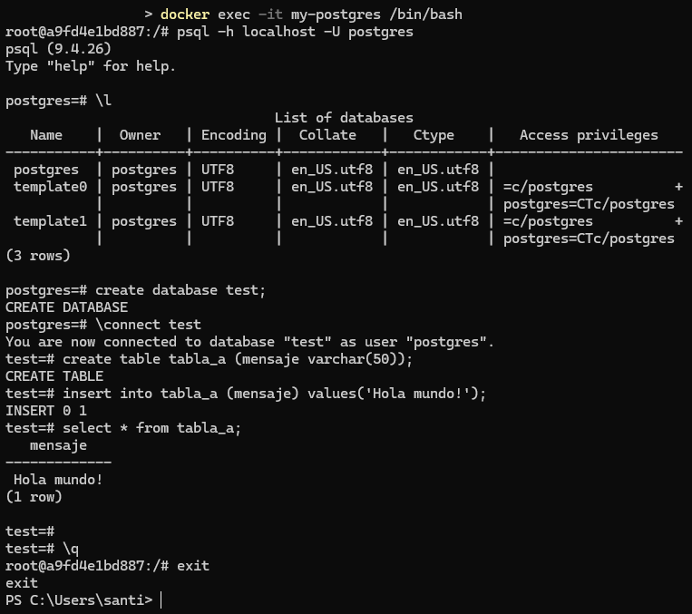

## Con Microsoft SQL Server
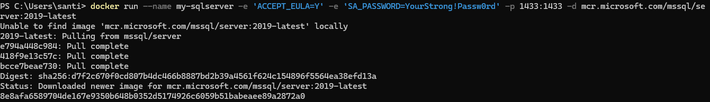
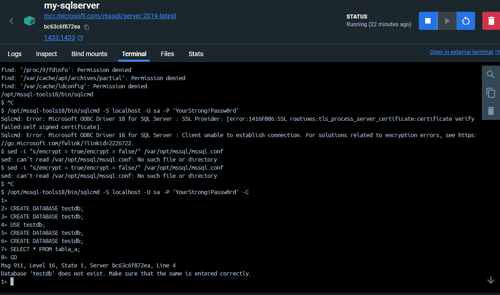