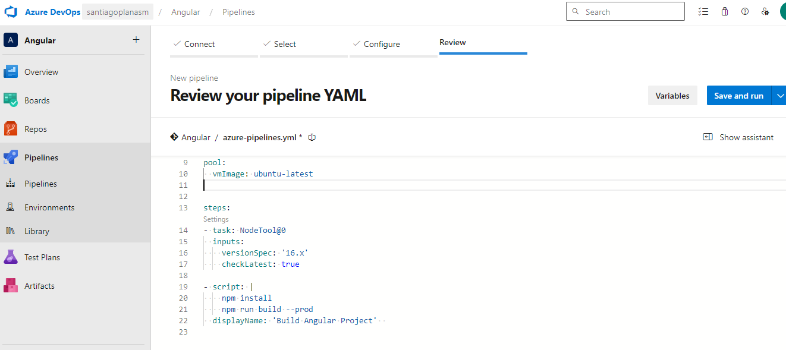

# Pipeline
## Azure DevOps Pipelines

###  Breve descripción de Azure DevOps Pipelines: 
* Azure DevOps Pipelines es un servicio que automatiza la construcción, prueba y despliegue de aplicaciones en múltiples entornos. Facilita la integración continua (CI) y la entrega continua (CD), mejorando la calidad del software y permitiendo un desarrollo más rápido.

#### Tipos de Pipelines:
* Build Pipelines: Se encargan de compilar y probar tu código. Suelen ser la primera fase en un proceso CI/CD.
* Deploy Pipelines: Se encargan de desplegar tu aplicación en entornos de producción o de prueba.

### Diferencias entre el editor clásico y YAML:
* Editor Clásico: Ofrece una interfaz gráfica para configurar los pipelines mediante tareas predefinidas.
* YAML: Es un archivo de texto que define el pipeline de forma declarativa, lo que permite un mayor control y portabilidad del pipeline.

### Agentes MS y Self-Hosted:
* Microsoft-hosted: Son agentes administrados por Microsoft, fáciles de configurar y usar, aunque limitados en cuanto a personalización.
* Self-Hosted: Corren en servidores propios, ofrecen más control sobre el entorno, pero requieren más mantenimiento.

## Desarollo
### Verificacion

### Tarea publish

### Explicación de la tarea de Publish en un agente MS
* La tarea de Publish es esencial para almacenar los artefactos generados, especialmente cuando el pipeline se ejecuta en un agente en la nube, donde el entorno es temporal y los artefactos se deben almacenar externamente.

### Pipe local

### Habilitar Clasico

### Clasico y resultados

### Config CL result de manera auto

### Diferencias entre agentes MS y Self-Hosted
* Un agente Self-Hosted te da control sobre el entorno, mientras que uno Microsoft-hosted es más fácil de configurar pero tiene menos personalización. Usar un agente Self-Hosted es ideal cuando necesitas software específico o acceso a recursos internos.

### Pool agentes

### Agente local

### Pipe con host local

### Pipe local con host

### 12- Angular

### Pipeline de angular conCI

### cambio en archivo

### Descargar pipeline

### Cambio

