## Trabajo Práctico 6 - Pruebas Unitarias

### 1- Objetivos de Aprendizaje
 - Adquirir conocimientos sobre conceptos referidos a pruebas unitarias (unit tests).
 - Generar y ejecutar pruebas unitarias utilizando frameworks disponibles.

### 2- Unidad temática que incluye este trabajo práctico
Este trabajo práctico corresponde a la unidad Nº: 5 (Libro Ingeniería de Software: Cap 8)

### 3- Consignas a desarrollar en el trabajo práctico:
#### ¿Qué son las pruebas de software?
Una prueba de software es una pieza de software que ejecuta otra pieza de software. Valida si ese código da como resultado el estado esperado (prueba de estado) o ejecuta la secuencia de eventos esperados (prueba de comportamiento).

#### ¿Por qué son útiles las pruebas de software?
Las pruebas unitarias de software ayudan al desarrollador a verificar que la lógica de una parte del programa sea correcta.

Ejecutar pruebas automáticamente ayuda a identificar regresiones de software introducidas por cambios en el código fuente. Tener una cobertura de prueba alta de su código le permite continuar desarrollando características sin tener que realizar muchas pruebas manuales.

#### Código (o aplicación) bajo prueba
El código que se prueba generalmente se llama código bajo prueba . Si está probando una aplicación, esto se llama la aplicación bajo prueba .

#### Prueba unitarias (Unit Tests)
Una prueba de unidad es una pieza de código escrita por un desarrollador que ejecuta una funcionalidad específica en el código que se probará y afirma cierto comportamiento o estado.

El porcentaje de código que se prueba mediante pruebas unitarias generalmente se llama cobertura de prueba.

Una prueba unitaria se dirige a una pequeña unidad de código, por ejemplo, un método o una clase. 

**Las dependencias externas deben eliminarse de las pruebas unitarias**, por ejemplo, reemplazando la dependencia con una  implementación de prueba o un objeto (mock) creado por un framework de prueba.

Las pruebas unitarias no son adecuadas para probar la interfaz de usuario compleja o la interacción de componentes. Para esto, es necesario desarrollar pruebas de integración.

#### Frameworks de pruebas unitarias
Hay varios frameworks de prueba disponibles para distintos entornos de programación como NUnit, JUnit,  XUnit, MSTest. En este práctico nos enfocaremos en Jasmine para Angular y XUnit para .NET Core.
- https://xunit.net/
- https://jasmine.github.io/

#### ¿Qué parte del software debería probarse?
Funcionalidad específica de una unidad de código: Una prueba unitaria debe evaluar una única unidad de código, como una función, método o clase. Debe centrarte en probar su funcionalidad específica y sus resultados esperados.

Caminos de ejecución: Asegurarse de probar todos los caminos de ejecución posibles dentro de la unidad de código. Esto incluye casos de éxito y casos de error.

Entradas y salidas: Verificar que la unidad de código maneje correctamente las entradas proporcionadas y produzca las salidas esperadas. Esto implica probar con una variedad de valores de entrada, incluyendo valores límite y casos extremos.

Manejo de excepciones: Si la unidad de código maneja excepciones, asegurarse de probar los casos en los que se lanzan excepciones y verifica que se manejen adecuadamente.

#### Convenciones de nombre:

Por lo general se utiliza la siguiente convención para nombrar a los tests unitarios: 

**Metodo a probar** _ **escenario** _ **resultadoEsperado**

Ejemplo:

**CanBeCancelledBy** _ **UserIsAdmin** _ **ReturnsTrue**

Dentro del código del test se debe utilizar el patrón Arrange, Act y Assert. Ejemplo:

**Arrange:** Crear el objeto o función a probar.

**Act**: Llamar al metodo con  sus parámetros

**Assert**: Evaluar el resultado

#### Familiarizarse con algunos Decoradores y Assert más comunes:

En el contexto de **xUnit** en C#, los "decoradores" o "atributos" son metadatos que se utilizan para proporcionar información adicional sobre las pruebas. Estos atributos permiten a xUnit realizar acciones específicas, como ejecutar pruebas unitarias o gestionar datos y el contexto compartido entre varias pruebas.

| Atributo                | Objetivo                                                                                           |
| ----------------------- | -------------------------------------------------------------------------------------------------- |
| `[Fact]`                | Marca un método como una prueba unitaria básica que no toma parámetros de entrada.                  |
| `[Theory]`              | Marca un método de prueba que se ejecuta varias veces con diferentes parámetros.                    |
| `[InlineData]`          | Proporciona valores de entrada para un método de prueba con `[Theory]`.                            |
| `[ClassData]`           | Proporciona una clase completa como fuente de datos para un método con `[Theory]`.                 |
| `[MemberData]`          | Proporciona datos de una propiedad o método para alimentar un `[Theory]`.                           |
| `[Collection]`          | Agrupa pruebas para que compartan contexto o recursos comunes.                                      |
| `[Trait]`               | Permite categorizar las pruebas con claves y valores (similar a `[Category]` en NUnit).             |
| `[Skip]`                | Omite una prueba, especificando opcionalmente una razón para saltarla.                             |
| `[CollectionDefinition]`| Define una colección de pruebas para que se ejecuten juntas, permitiendo compartir contextos.       |
| `[ClassFixture]`        | Ejecuta código de inicialización compartido para todas las pruebas en una clase.                    |
| `[CollectionFixture]`   | Ejecuta código de inicialización compartido entre varias clases de prueba.                          |
| `[BeforeAfterTest]`     | Marca un atributo para ejecutar código antes y después de cada prueba en un método.                 |
| `[Data]`                | Fuente de datos personalizada para un `[Theory]`.                                                  |
| `[IClassFixture]`       | Define un constructor para instanciar un fixture de clase que será compartido entre todas las pruebas de la clase. |
| `[Output]`              | Permite la inyección de salida de pruebas, como escribir información de diagnóstico.               |

En **Jasmine**, los "decoradores" equivalen a diferentes estructuras y funciones que permiten definir y gestionar pruebas unitarias de manera declarativa. Estas funciones permiten describir el comportamiento esperado de tu código y realizar aserciones.

| Decorador/Matcher        | Objetivo                                                                                           |
| ------------------------ | -------------------------------------------------------------------------------------------------- |
| `describe()`             | Agrupa varias pruebas bajo una misma suite o conjunto lógico de pruebas.                            |
| `it()`                   | Define una prueba individual.                                                                      |
| `beforeEach()`           | Ejecuta código antes de cada prueba dentro de un bloque `describe`.                                 |
| `afterEach()`            | Ejecuta código después de cada prueba dentro de un bloque `describe`.                               |
| `beforeAll()`            | Ejecuta código una vez, antes de todas las pruebas en el bloque `describe`.                         |
| `afterAll()`             | Ejecuta código una vez, después de todas las pruebas en el bloque `describe`.                       |
| `expect()`               | Realiza una aserción o verificación sobre un valor esperado.                                        |
| `toBe()`                 | Verifica si dos valores son exactamente iguales.                                                    |
| `toEqual()`              | Verifica si dos objetos son equivalentes en valor, comparando propiedades.                          |
| `toBeTruthy()`           | Verifica si un valor es verdadero (truthy).                                                         |
| `toBeFalsy()`            | Verifica si un valor es falso (falsy).                                                              |
| `toBeNull()`             | Verifica si un valor es `null`.                                                                     |
| `toBeUndefined()`        | Verifica si un valor es `undefined`.                                                                |
| `toContain()`            | Verifica si una colección o cadena contiene un elemento o subcadena en particular.                  |
| `toThrow()`              | Verifica si una función lanza una excepción al ejecutarse.                                          |
| `toThrowError()`         | Verifica si una función lanza un error en particular.                                               |
| `spyOn()`                | Crea un espía para observar y modificar el comportamiento de funciones o métodos.                   |
| `jasmine.createSpy()`    | Crea un espía que simula el comportamiento de una función.                                          |
| `jasmine.any()`          | Verifica si un valor es de un tipo en particular (como `string`, `number`, etc.).                   |
| `jasmine.objectContaining()` | Verifica si un objeto contiene una propiedad con un valor específico.                          |
| `pending()`              | Marca una prueba como pendiente (todavía no implementada).                                          |
| `fail()`                 | Fuerza que una prueba falle intencionalmente.                                                       |

En xUnit, los comandos Assert se utilizan para verificar las condiciones y resultados de las pruebas unitarias. A continuación, se muestra una lista de algunos de los comandos `Assert` más comúnmente utilizados en xUnit:

| Comando                                     | Descripción                                                                                       |
| ------------------------------------------- | ------------------------------------------------------------------------------------------------- |
| `Assert.Equal(expected, actual)`            | Verifica si el valor `actual` es igual al valor `expected`.                                        |
| `Assert.NotEqual(notExpected, actual)`      | Verifica si el valor `actual` no es igual al valor `notExpected`.                                  |
| `Assert.True(condition)`                    | Verifica si la condición especificada es `true`.                                                   |
| `Assert.False(condition)`                   | Verifica si la condición especificada es `false`.                                                  |
| `Assert.Null(object)`                       | Verifica si el objeto especificado es `null`.                                                      |
| `Assert.NotNull(object)`                    | Verifica si el objeto especificado no es `null`.                                                   |
| `Assert.Throws<ExceptionType>(() => ...)`   | Verifica si se produce una excepción del tipo `ExceptionType` al ejecutar la acción especificada.   |
| `Assert.ThrowsAny<ExceptionType>(() => ...)`| Verifica si se produce cualquier excepción del tipo `ExceptionType`.                               |
| `Assert.Empty(collection)`                  | Verifica si una colección está vacía.                                                              |
| `Assert.NotEmpty(collection)`               | Verifica si una colección no está vacía.                                                           |
| `Assert.Contains(expectedItem, collection)` | Verifica si una colección contiene un elemento específico.                                         |
| `Assert.DoesNotContain(notExpected, collection)`| Verifica si una colección no contiene un elemento específico.                                      |
| `Assert.Same(expected, actual)`             | Verifica si dos objetos hacen referencia al mismo objeto (misma instancia).                        |
| `Assert.NotSame(notExpected, actual)`       | Verifica si dos objetos no hacen referencia al mismo objeto.                                       |
| `Assert.InRange(actual, low, high)`         | Verifica si un valor está dentro de un rango específico.                                           |
| `Assert.NotInRange(actual, low, high)`      | Verifica si un valor no está dentro de un rango específico.                                        |
| `Assert.Collection(collection, params Action<object>[])` | Verifica que cada elemento en la colección cumple con un conjunto de acciones de validación.      |
| `Assert.Equal(expectedCollection, actualCollection)` | Compara dos colecciones para verificar si son iguales en términos de contenido y orden.            |

En Jasmine, los comandos de `expect` se utilizan para verificar las condiciones y resultados de las pruebas unitarias. A continuación, se muestra una lista de algunos de los comandos `expect` más comúnmente utilizados en Jasmine:

| Comando                                         | Descripción                                                                                         |
| ----------------------------------------------- | --------------------------------------------------------------------------------------------------- |
| `expect(actual).toEqual(expected)`              | Verifica si el valor `actual` es igual al valor `expected` (comparación de igualdad profunda).       |
| `expect(actual).not.toEqual(expected)`          | Verifica si el valor `actual` no es igual al valor `expected`.                                       |
| `expect(actual).toBe(expected)`                 | Verifica si el valor `actual` es exactamente igual al valor `expected` (comparación estricta).       |
| `expect(actual).not.toBe(expected)`             | Verifica si el valor `actual` no es exactamente igual al valor `expected`.                           |
| `expect(actual).toBeTrue()`                     | Verifica si el valor `actual` es `true`.                                                            |
| `expect(actual).toBeFalse()`                    | Verifica si el valor `actual` es `false`.                                                           |
| `expect(actual).toBeNull()`                     | Verifica si el valor `actual` es `null`.                                                            |
| `expect(actual).not.toBeNull()`                 | Verifica si el valor `actual` no es `null`.                                                         |
| `expect(actual).toBeUndefined()`                | Verifica si el valor `actual` es `undefined`.                                                       |
| `expect(actual).not.toBeUndefined()`            | Verifica si el valor `actual` no es `undefined`.                                                    |
| `expect(actual).toContain(expected)`            | Verifica si una colección o cadena contiene el valor `expected`.                                     |
| `expect(actual).not.toContain(expected)`        | Verifica si una colección o cadena no contiene el valor `expected`.                                  |
| `expect(actual).toBeGreaterThan(expected)`      | Verifica si el valor `actual` es mayor que el valor `expected`.                                      |
| `expect(actual).toBeLessThan(expected)`         | Verifica si el valor `actual` es menor que el valor `expected`.                                      |
| `expect(actual).toThrow()`                      | Verifica si se lanza una excepción cuando se ejecuta una función.                                    |
| `expect(actual).toThrowError()`                 | Verifica si se lanza un error cuando se ejecuta una función.                                         |
| `expect(actual).toBeCloseTo(expected, precision)`| Verifica si el valor `actual` está cerca del valor `expected` dentro de un cierto nivel de precisión. |
| `expect(actual).toBeDefined()`                  | Verifica si el valor `actual` está definido.                                                         |
| `expect(actual).not.toBeDefined()`              | Verifica si el valor `actual` no está definido.                                                      |
| `expect(actual).toMatch(regexp)`                | Verifica si una cadena coincide con una expresión regular.                                           |
| `expect(array).toHaveSize(size)`                | Verifica si una colección tiene el tamaño especificado.                                              |

#### Introducción a Mock
Las pruebas unitarias se centran en evaluar unidades de código de manera aislada, sin depender de las implementaciones reales de las dependencias externas. Esto significa que, en las pruebas unitarias, se utilizan mocks o simulaciones para representar las dependencias externas y controlar su comportamiento. El objetivo principal de las pruebas unitarias es verificar que cada unidad de código (como una función, método o clase) funcione correctamente por sí misma, independientemente de las dependencias externas.

Las pruebas de integración, por otro lado, tienen como objetivo evaluar la interacción y la integración de múltiples unidades de código o componentes, incluyendo sus dependencias externas. En las pruebas de integración, se prueban escenarios en los que varias partes del sistema trabajan juntas, y se verifica que se comuniquen y se integren de manera adecuada.

Es decir que las pruebas unitarias se realizan sin depender de las implementaciones reales de las dependencias externas, utilizando mocks o simulaciones, con el objetivo de probar unidades de código de forma aislada.

Para reemplazar estas dependencias reales por "dobles" o "fakes" se utilizan frameworks de Mock que simplifican significativamente el desarrollo de pruebas para clases con dependencias externas.

El framework de Mock (mocking framework) más comúnmente utilizado en el contexto de .NET Core es "Moq". Moq es una biblioteca de código abierto que permite crear objetos simulados (mocks) para representar dependencias externas y controlar su comportamiento durante las pruebas unitarias.

Un ejemplo común de lo que se "mockea" en las pruebas unitarias es una dependencia externa que involucre una llamada a una base de datos o un servicio web. Al mockear esta dependencia, se puede aislar la unidad de código que se está probando y evitar la necesidad de interactuar con una base de datos real o un servicio externo durante las pruebas.

Moq es un marco de pruebas y simulación (mocking framework) para el lenguaje de programación C# en el entorno de desarrollo de .NET. Permite a los desarrolladores crear objetos simulados, llamados "mocks" o "stubs", para simular el comportamiento de componentes del sistema durante las pruebas unitarias.

Algunas de las características y ventajas clave de Moq incluyen:

- Sintaxis Fluent: Moq utiliza una sintaxis fluent y expresiva que facilita la creación y configuración de objetos simulados. Esto hace que las pruebas sean más legibles y mantenibles.

- Generación Dinámica: Moq genera objetos simulados en tiempo de ejecución, lo que significa que no es necesario escribir clases separadas para implementar mocks. Esto ahorra tiempo y reduce la complejidad del código de prueba.

- Configuración de Comportamiento: Puedes configurar cómo debe comportarse un objeto simulado cuando se llama a sus métodos o propiedades. Esto incluye especificar los valores de retorno, establecer acciones personalizadas y verificar si se han llamado métodos específicos.

- Verificación de Llamadas: Moq permite verificar si se han llamado los métodos simulados y cuántas veces se han llamado. Esto es útil para asegurarse de que el código bajo prueba interactúa correctamente con sus dependencias simuladas.

- Soporte para Pruebas Parametrizadas: Moq es compatible con pruebas parametrizadas, lo que significa que puedes ejecutar la misma prueba con múltiples conjuntos de datos o escenarios, cambiando la configuración de los mocks según sea necesario.

- Integración con Marcos de Pruebas: Moq se integra bien con marcos de pruebas populares como NUnit y xUnit.NET, lo que facilita la incorporación de mocks en tus pruebas unitarias.

- Ligero y de Código Abierto: Moq es una biblioteca de código abierto y liviana que no agrega una sobrecarga significativa a tu proyecto.

En resumen, Moq es una herramienta valiosa para escribir pruebas unitarias efectivas en C#. Permite a los desarrolladores crear mocks de manera rápida y sencilla para simular el comportamiento de las dependencias y componentes externos, lo que facilita la prueba aislada de unidades de código y la identificación de problemas en el código durante el desarrollo.

### 4- Desarrollo:

#### 4.1 Creación de una BD SQL Server para nuestra App
A\. Crear una BD Azure SQL Database (Ver Instructivo 5.1)
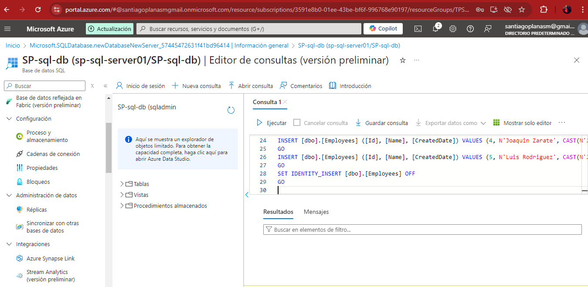
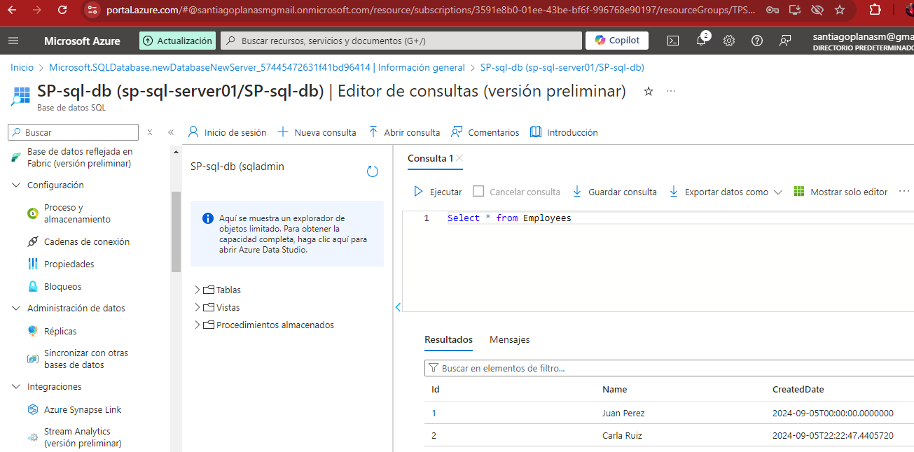

#### 4.2 Obtener nuestra App
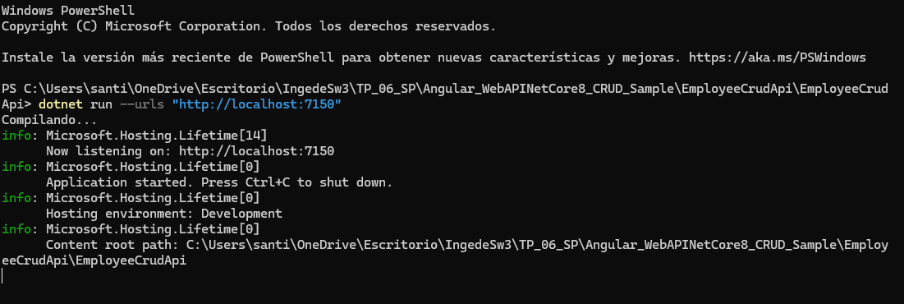
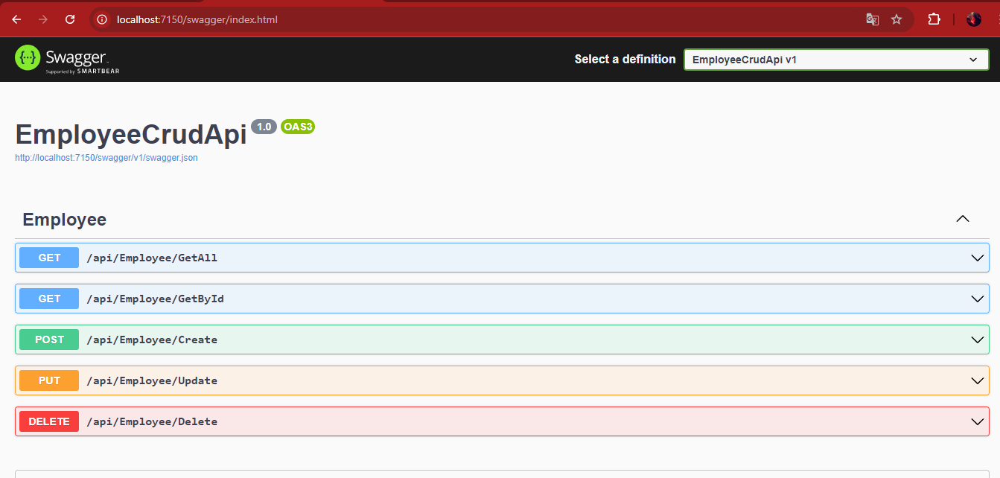
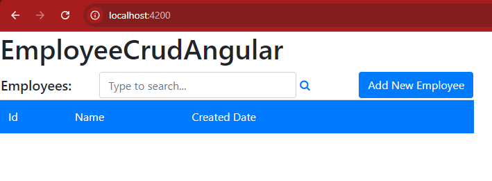

#### 4.3 Crear Pruebas Unitarias para nuestra API
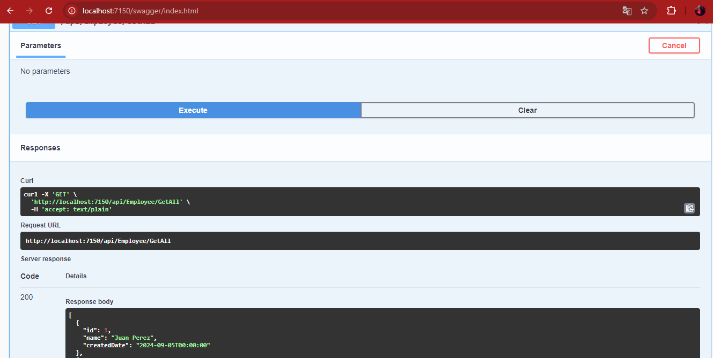
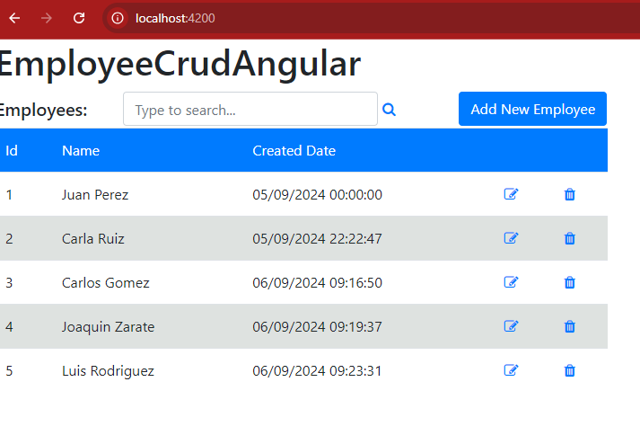

#### 4.4 Creamos pruebas unitarias para nuestro front de Angular:
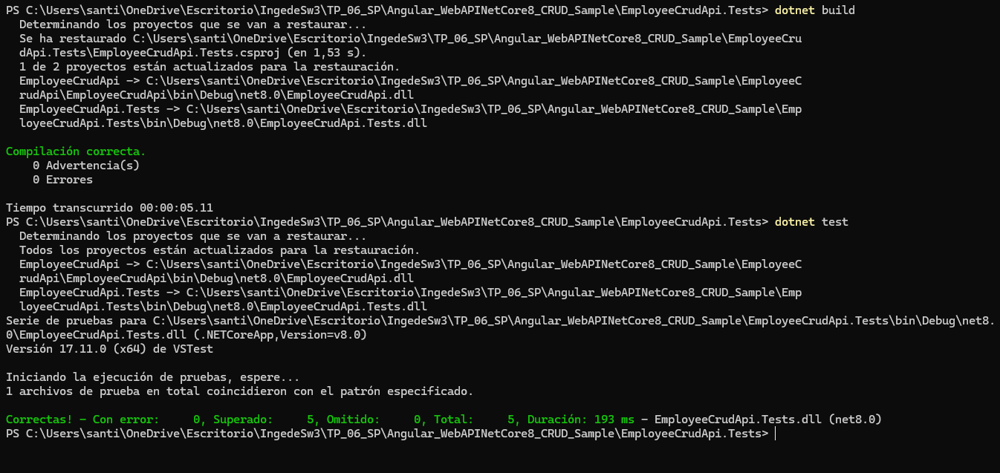
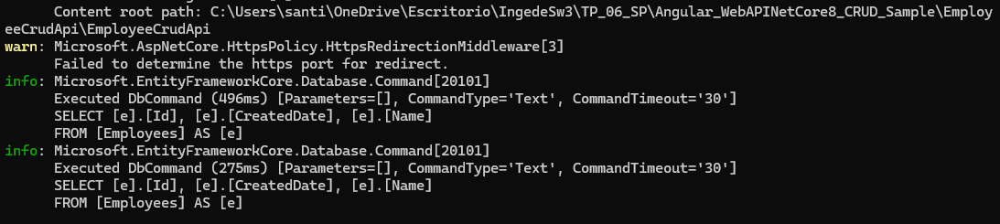
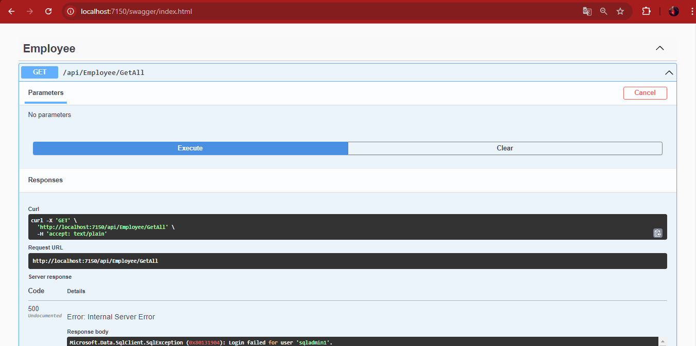
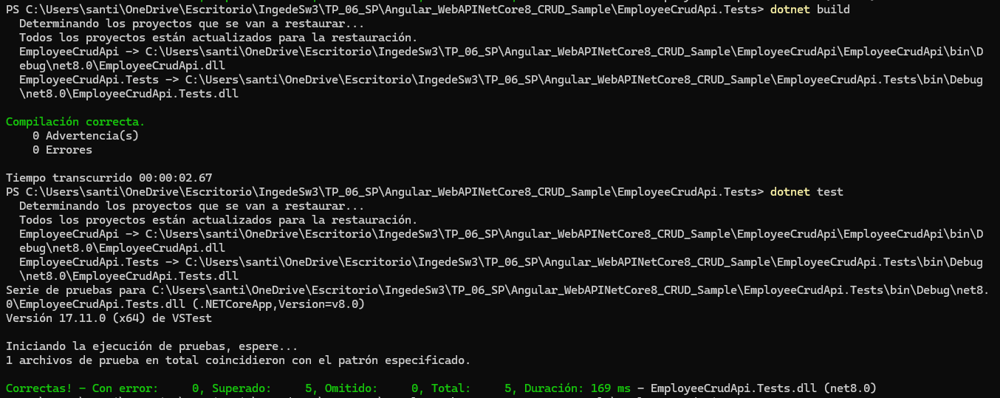
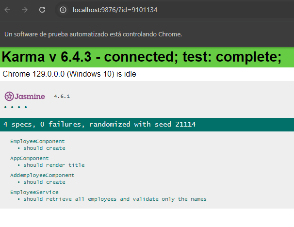
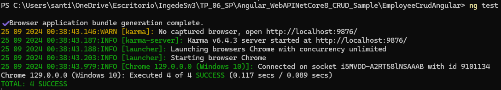

#### 4.5 Agregamos generación de reporte XML de nuestras pruebas de front.
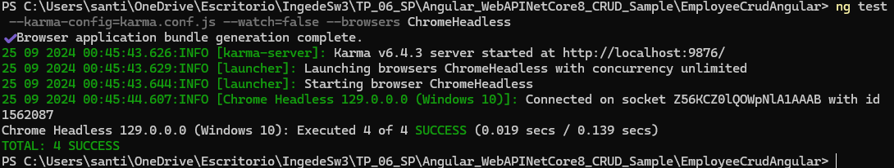
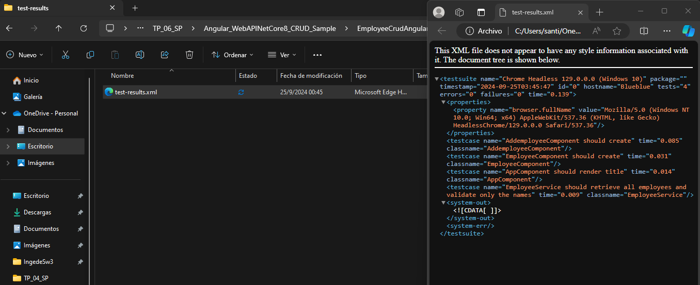

#### 4.6 Modificamos el código de nuestra API y creamos nuevas pruebas unitarias:
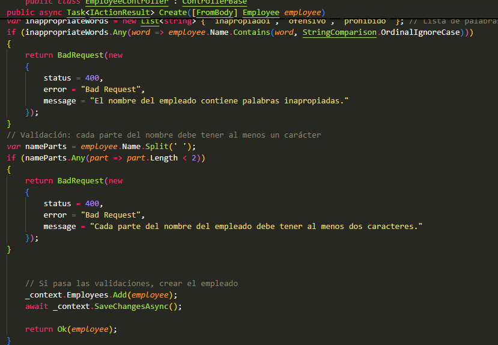
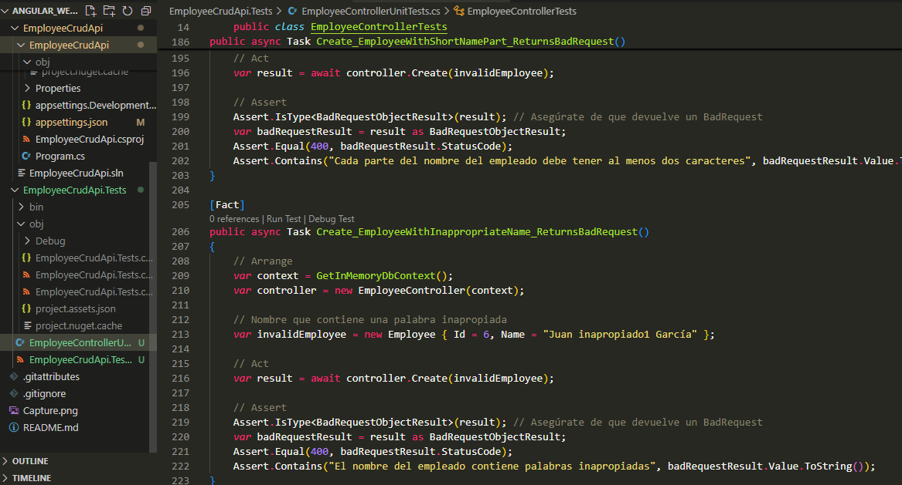
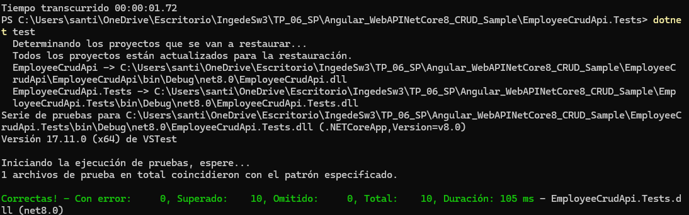

#### 4.7 Modificamos el código de nuestro Front y creamos nuevas pruebas unitarias:

