## Trabajo Práctico 7 - Code Coverage, Análisis estático de Código y Pruebas de Integración

### 1- Objetivos de Aprendizaje

Al finalizar esta sesión, los estudiantes serán capaces de:

1. **Evaluar la cobertura de pruebas (Code Coverage)**:
   - Explicar el concepto de cobertura de pruebas y su relevancia para asegurar la calidad del software.
   - Medir y analizar el porcentaje de código cubierto por pruebas automatizadas mediante herramientas específicas.
   - Mejorar la cobertura de pruebas para asegurar que los casos críticos y excepcionales están adecuadamente testeados.

2. **Comprender el análisis estático de código**:
   - Definir qué es el análisis estático de código y su importancia en el ciclo de desarrollo de software.
   - Identificar cómo el análisis estático ayuda a detectar errores, vulnerabilidades de seguridad y malas prácticas en el código sin necesidad de ejecutarlo.
   - Utilizar herramientas como **SonarCloud** para realizar análisis estático y generar reportes de calidad de código.

3. **Aplicar pruebas de integración**:
   - Definir qué son las pruebas de integración y cómo garantizan que los módulos de una aplicación interactúen correctamente.
   - Implementar pruebas de integración que simulen escenarios reales y validen la comunicación entre diferentes componentes de una aplicación.
   - Usar herramientas como **Cypress** para realizar pruebas de integración en aplicaciones web.

4. **Integrar análisis estático, cobertura de pruebas y pruebas de integración en un pipeline de CI/CD**:
   - Combinar el uso de SonarCloud, herramientas de cobertura de pruebas y Cypress en un flujo de integración continua para asegurar la calidad global del software.
   - Interpretar los resultados de estos análisis para tomar decisiones de mejora y refactorización del código.

Estos objetivos están alineados con el desarrollo de habilidades críticas para asegurar la calidad del software, abarcando tanto el análisis estático como dinámico mediante pruebas automatizadas.

### 2- Unidad temática que incluye este trabajo práctico
Este trabajo práctico corresponde a la unidad Nº: 5 (Libro Ingeniería de Software: Cap 8)

### 3- Consignas a desarrollar en el trabajo práctico:

#### Conceptos generales y explicaciones de los mismos

##### 3.1. Cobertura de Pruebas (Code Coverage)

**¿Qué es Code Coverage?**
La cobertura de pruebas es una métrica que mide el porcentaje de código ejecutado cuando se corren pruebas automatizadas sobre una aplicación. Básicamente, calcula qué partes del código fueron “cubiertas” por las pruebas y cuáles no, permitiendo a los desarrolladores saber si sus pruebas están examinando la mayoría del código relevante o si hay áreas importantes no verificadas.

**¿Por qué es importante medir cuánto del código es cubierto por pruebas automatizadas?**

- **Asegura la robustez del software**: Una cobertura de código alta indica que la mayor parte del código ha sido sometido a pruebas, lo que reduce la probabilidad de que errores o fallos inesperados ocurran en producción.

- **Identifica áreas no cubiertas**: La cobertura de pruebas permite identificar partes del código que no han sido probadas en absoluto. Esto es útil para asegurarse de que todos los escenarios, incluyendo casos de error o excepciones, estén siendo considerados en las pruebas.

- **Mejora la calidad del código**: Al generar informes de cobertura, los desarrolladores pueden enfocarse en mejorar y aumentar las pruebas para cubrir áreas críticas del sistema, lo que contribuye a un software más estable y confiable.

- **Optimización del esfuerzo de pruebas**: La medición de la cobertura de código permite priorizar las pruebas, enfocándose en las áreas más críticas o complejas del código que deben ser verificadas.

##### 3.2. Análisis Estático de Código
**¿Qué es?**
El análisis estático de código es el proceso de examinar el código fuente de una aplicación sin necesidad de ejecutarlo. Este análisis se realiza mediante herramientas automatizadas que revisan el código en busca de errores, vulnerabilidades, y malas prácticas. A diferencia del análisis dinámico, que requiere que el software esté en funcionamiento, el análisis estático se realiza antes de la ejecución del código, generalmente durante la fase de desarrollo o en pipelines de integración continua.

**¿Cómo ayuda a identificar errores, vulnerabilidades y malas prácticas?**

- **Errores comunes de programación**: El análisis estático puede detectar errores sintácticos o lógicos que podrían no ser visibles a simple vista. Esto incluye problemas como el uso incorrecto de variables, bucles infinitos, o referencias nulas.

- **Vulnerabilidades de seguridad**: Herramientas como SonarCloud analizan posibles vulnerabilidades como inyecciones de SQL, XSS (Cross-Site Scripting), o manejo inadecuado de datos sensibles. Esto es crucial para prevenir ataques y garantizar la seguridad del software.

- **Malas prácticas**: El análisis estático también identifica patrones de código que, aunque no son incorrectos desde el punto de vista técnico, pueden afectar negativamente la mantenibilidad y legibilidad del código. Ejemplos incluyen duplicación de código, funciones demasiado largas o un uso ineficiente de recursos.

- **Cumplimiento de estándares**: Estas herramientas también aseguran que el código cumpla con normas y buenas prácticas establecidas, como los estándares de la industria OWASP para seguridad o convenciones de estilo de codificación.

##### 3.3. Pruebas de Integración

**¿Qué son las Pruebas de Integración?**
Las pruebas de integración son un tipo de prueba de software que verifica si los diferentes módulos o componentes de una aplicación funcionan correctamente cuando interactúan entre sí. En lugar de probar componentes individuales de forma aislada (como se hace en las pruebas unitarias), las pruebas de integración evalúan si esos componentes, cuando se combinan, producen el comportamiento esperado.

**¿Cómo garantizan que los diferentes módulos o servicios de una aplicación funcionen correctamente al interactuar entre sí?**

- **Simulación de flujos reales**: Las pruebas de integración simulan escenarios reales en los que varios componentes de la aplicación trabajan juntos. Por ejemplo, en una aplicación web, podrían verificar que el front-end (interfaz de usuario) puede comunicarse correctamente con el back-end (API) para realizar solicitudes y obtener datos.

- **Detección de errores de comunicación**: Estas pruebas permiten identificar problemas que no son evidentes en las pruebas unitarias, como la incompatibilidad entre diferentes interfaces de componentes o errores en la configuración de servicios externos (como bases de datos o APIs de terceros).

- **Validación de contratos y dependencias**: Verifican que las dependencias entre componentes están bien implementadas y que los contratos (por ejemplo, los formatos de datos intercambiados entre ellos) son respetados. Esto es esencial cuando los módulos deben cumplir con requisitos específicos para comunicarse correctamente.

- **Aseguran la estabilidad del sistema**: Las pruebas de integración detectan problemas que surgen cuando componentes que funcionan bien por separado comienzan a fallar al interactuar, garantizando que la funcionalidad completa del sistema esté libre de fallos.

### 4- Desarrollo:
#### Prerequisitos:

#### 4.1 Agregar Code Coverage a nuestras pruebas unitarias de backend y front-end e integrarlas junto con sus resultados en nuestro pipeline de build.
- Desarrollo del punto 4.1: 
	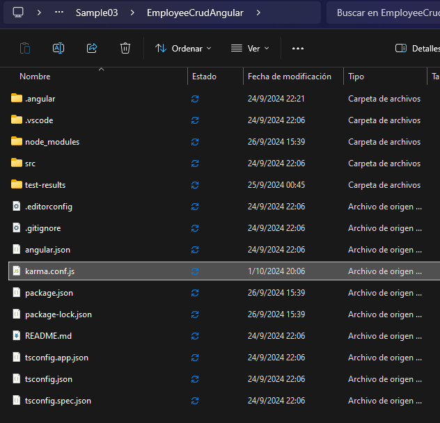
    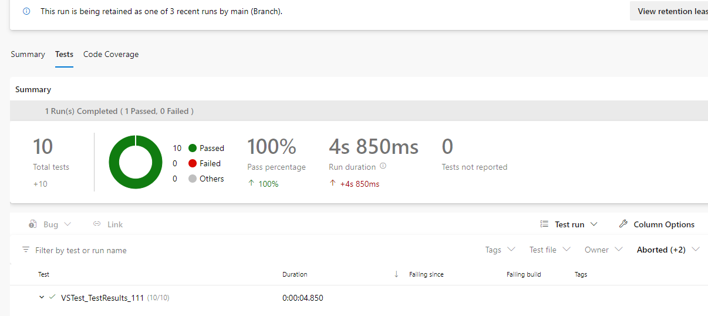
    

#### 4.2 Agregar Análisis Estático de Código con SonarCloud:

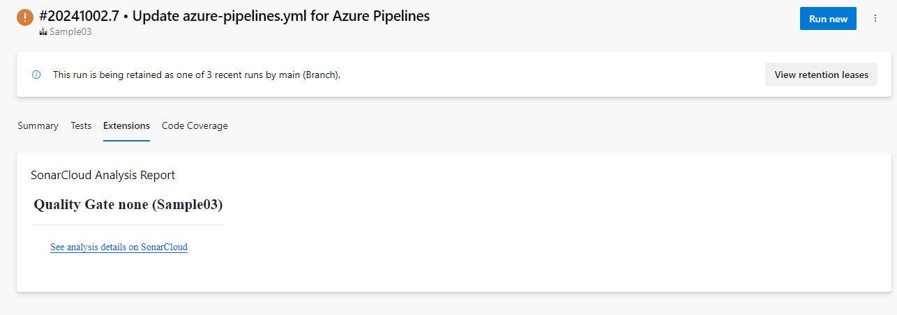
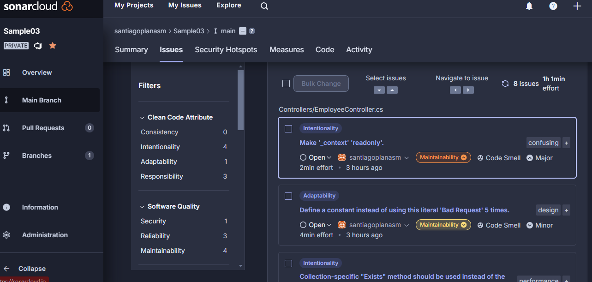

#### 4.3 Pruebas de Integración con Cypress:        |

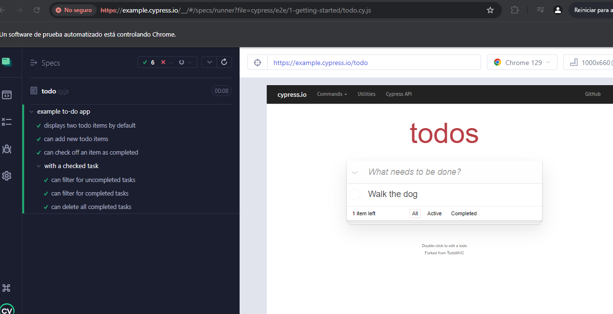

##### 4.3.4 Crear nuestra primera prueba navegando a nuestro front.

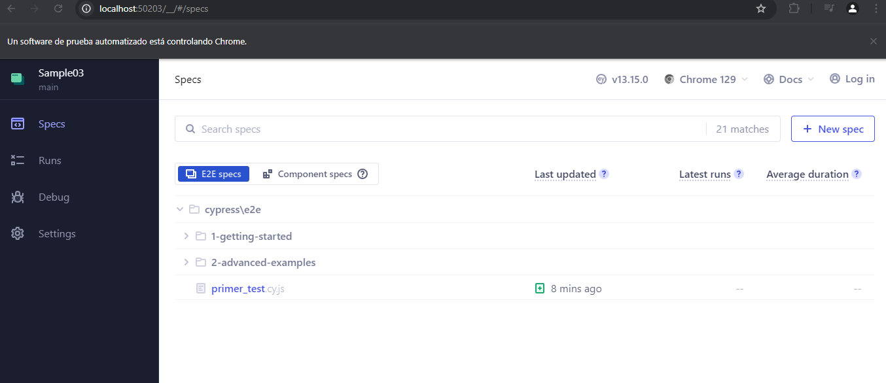
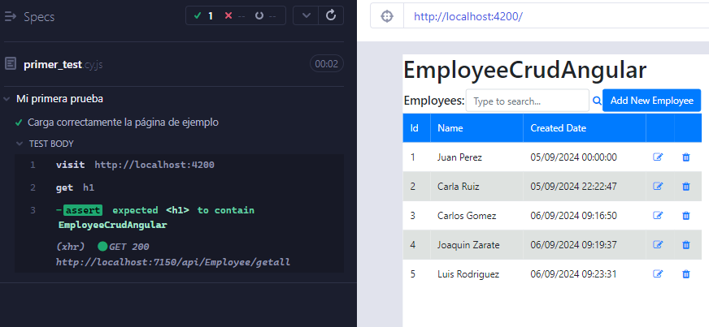
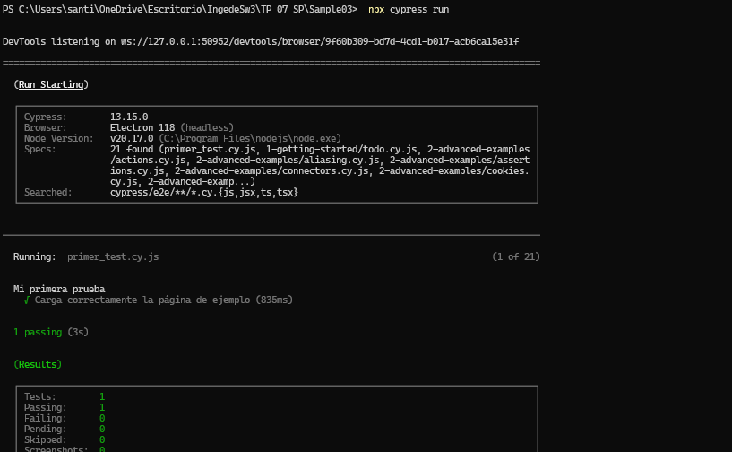

##### 4.3.6 Modificar nuestra prueba para que falle.
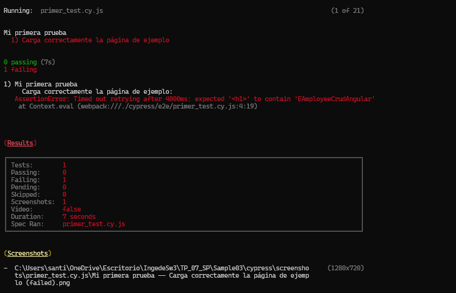

##### 4.3.6 Grabar nuestras pruebas para que Cypress genere código 
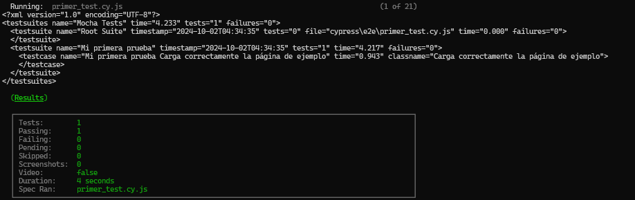

##### 4.3.7 Hacemos prueba de editar un empleado
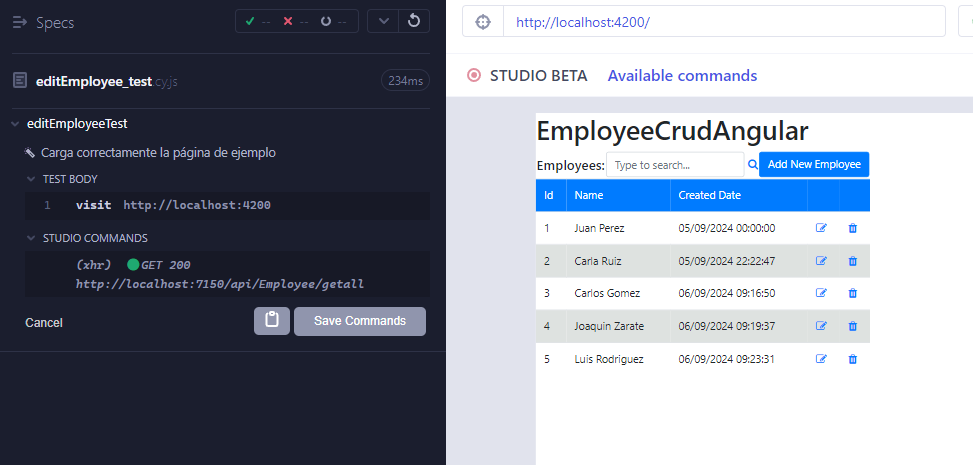
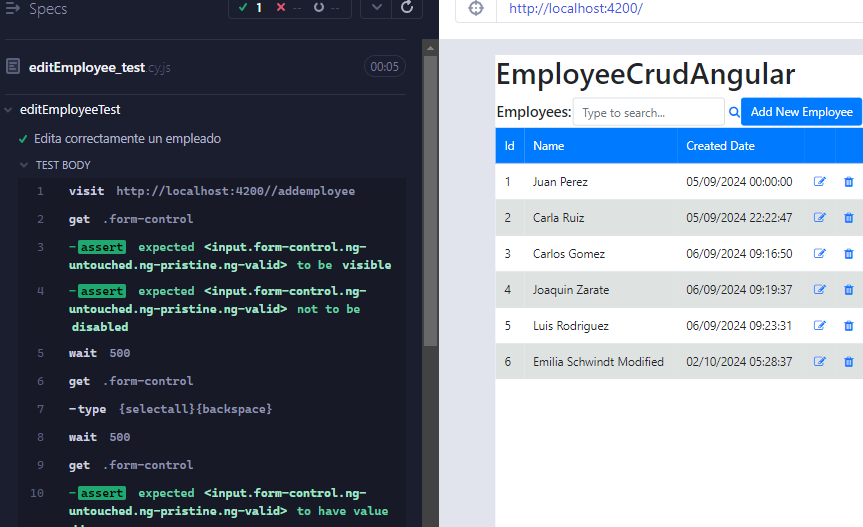

#### 4.4 Desafíos:
- Integrar en el pipeline SonarCloud para nuestro proyecto Angular, mostrar el resultado obtenido en SonarCloud
- Implementar en Cypress pruebas de integración que incluya los casos desarrollados como pruebas unitarias del front en el TP06.
- Incorporar al pipeline de Deploy la ejecución de las pruebas de integración y la visualización de sus resultados.
- **Resultado esperado**:
    - Un Pipeline en YAML que incluya a) Build de QA y Front con ejecución y resultado de pruebas de code coverage, pruebas unitarias y análisis de Sonar Cloud y b) Deploy a WebApp(s) de QA y Front que incluya ejecución y resultado de pruebas de integración

    

    - Dos Stages: Una para Build, Test Unitarios, Code Coverage y SonarCloud y otra para el Deploy a QA con Tests de Integración

	

    - En la pestaña Test, poder visualizar los Test Unitarios de Front y Back y los Test de Integracion:

	

    - En la pestaña Code Coverage, visualizar la cobertura de las pruebas unitarias de Back y de Front:

	

    - En la pestaña Extensions, ver el análisis de SonarCloud en verde

       
    
    - Un documento de una carilla explicando qué información pudieron sacar del análisis de Sonar Cloud y de las pruebas de cobertura.

