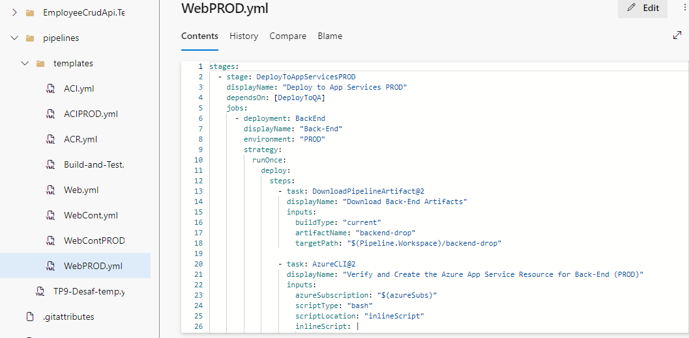
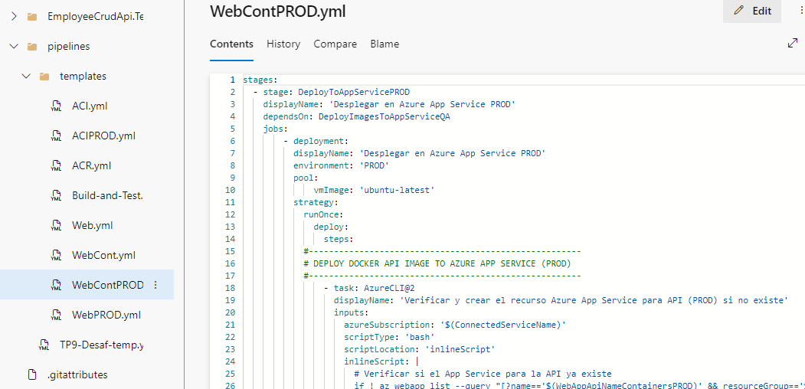

## Trabajo Práctico 9 - Implementación de Contenedores en Azure Parte 2
### 4- Desarrollo:

#### 4.1 Modificar nuestro pipeline para incluir el deploy en QA y PROD de Imagenes Docker en Servicio Azure App Services con Soporte para Contenedores
- Desarrollo del punto 4.1: 
	
  	- ##### 4.1.1 - Agregar a nuestro pipeline una nueva etapa que dependa de nuestra etapa de Construcción y Pruebas y de la etapa de Construcción de Imagenes Docker y subida a ACR realizada en el TP08
  	    
  	  - Agregar tareas para crear un recurso Azure Container Instances que levante un contenedor con nuestra imagen de back utilizando un AppServicePlan en Linux
	  	
  	    
  	     
#### 4.2 Desafíos:
- 4.2.1 Agregar tareas para generar Front en Azure App Service con Soporte para Contenedores

- 4.2.2 Agregar variables necesarias para el funcionamiento de la nueva etapa considerando que debe haber 2 entornos QA y PROD para Back y Front.

- Funcionando

- 4.2.3 Agregar tareas para correr pruebas de integración en el entorno de QA de Back y Front creado en Azure App Services con Soporte para Contenedores. 

- 4.2.4 Agregar etapa que dependa de la etapa de Deploy en QA que genere un entorno de PROD.

- 4.2.5 Entregar un pipeline que incluya:

    
    

  - A) Etapa Construcción y Pruebas Unitarias y Code Coverage Back y Front
      

  - B) Construcción de Imágenes Docker y subida a ACR
      

  - C) Deploy Back y Front en QA con pruebas de integración para Azure Web Apps
      

  - D) Deploy Back y Front en QA con pruebas de integración para ACI
      

  - E) Deploy Back y Front en QA con pruebas de integración para Azure Web Apps con Soporte para contenedores
      

  - FRONTS DE QA y PIPELINE
      
      
      

  - F) Aprobación manual de QA para los puntos C,D,E
      

  - G) Deploy Back y Front en PROD para Azure Web Apps
      

  - H) Deploy Back y Front en PROD para ACI
      

  - I) Deploy Back y Front en PROD para Azure Web Apps con Soporte para contenedores
      

  - FRONTS DE PROD y PIPELINE
      
      

###### Se borraron servicios pagos despues de su uso