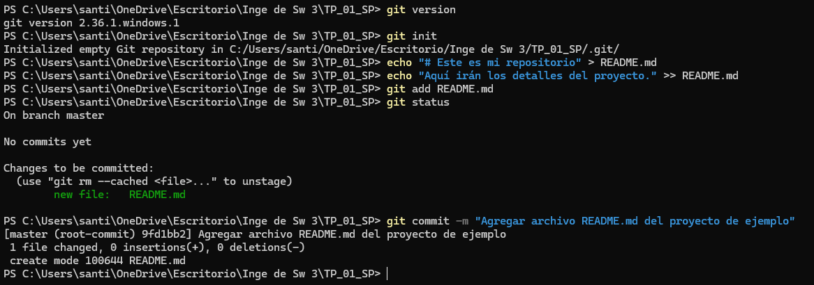
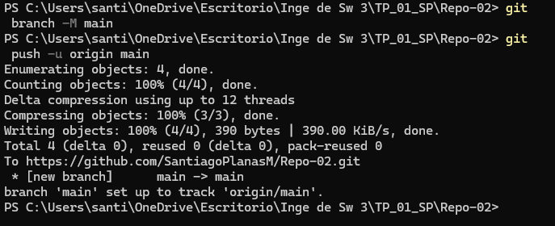
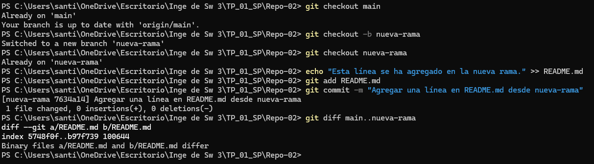
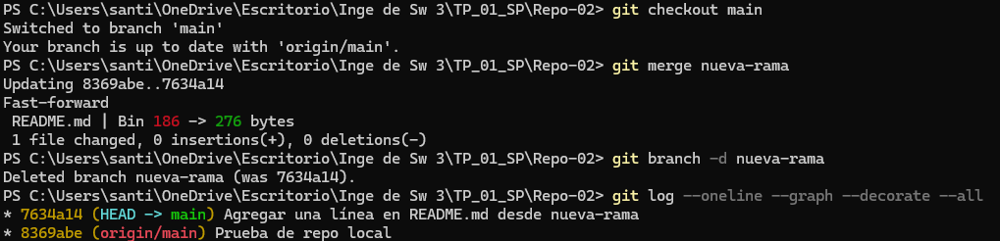
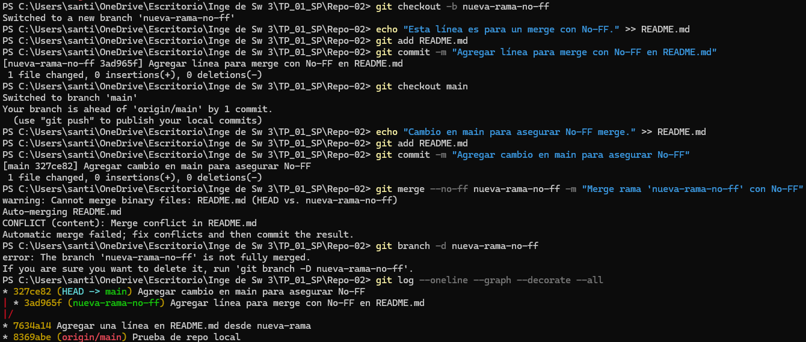
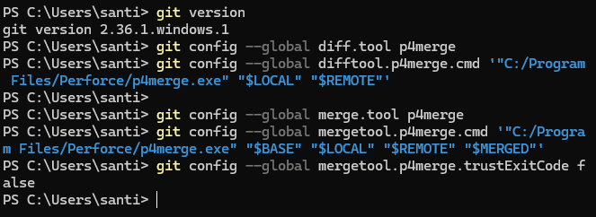
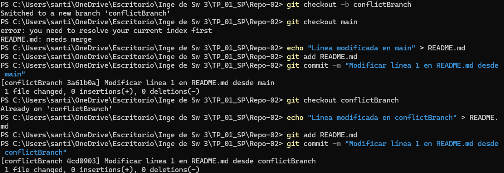
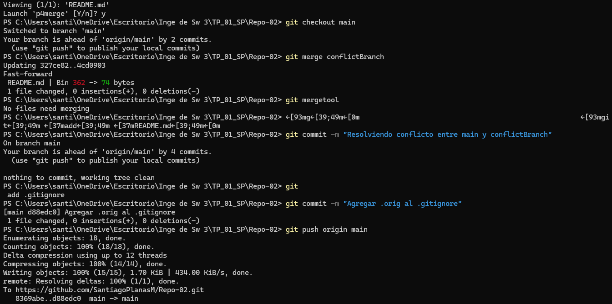
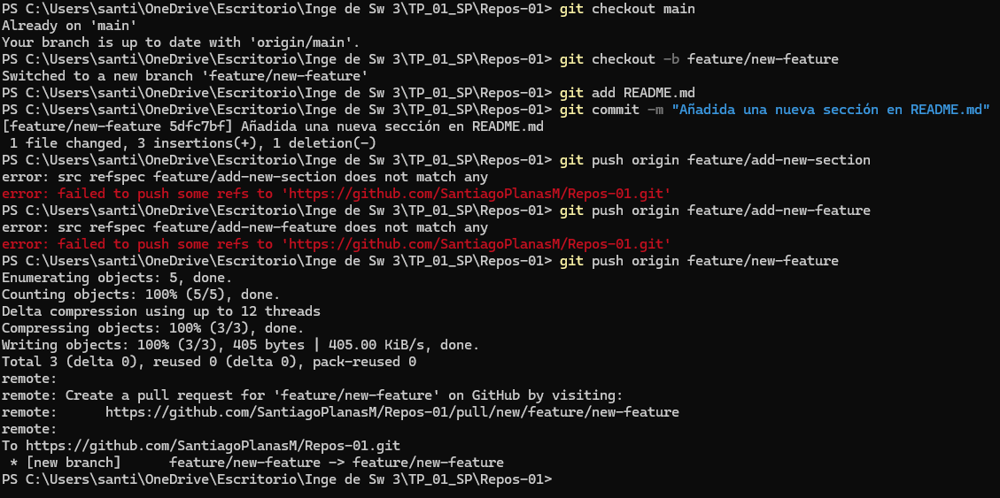

# Git Basico
## Desarollo
### Repo local

### Creación de Repos 01 

### Creación de Repos 02

### Ramas

### Merges

### Resolución de Conflictos

### Pull Request

* Qué es un Pull Request?
Un Pull Request (PR) es una función en sistemas de control de versiones distribuidos como Git, especialmente cuando se usa en plataformas como GitHub, GitLab o Bitbucket. Un PR es una solicitud para fusionar cambios que se han realizado en una rama (branch) a otra rama, generalmente main o master.

 * Propósito: Facilita la revisión del código por parte de otros miembros del equipo antes de que los cambios se integren en la rama principal. También es una oportunidad para discutir posibles mejoras o identificar errores.
  * Proceso de Revisión: Cuando creas un PR, otros desarrolladores pueden revisar los cambios, hacer comentarios, solicitar modificaciones, o aprobar los cambios. Una vez que todos están de acuerdo, el PR se puede fusionar (merge) en la rama objetivo.

### Ejercicios online
